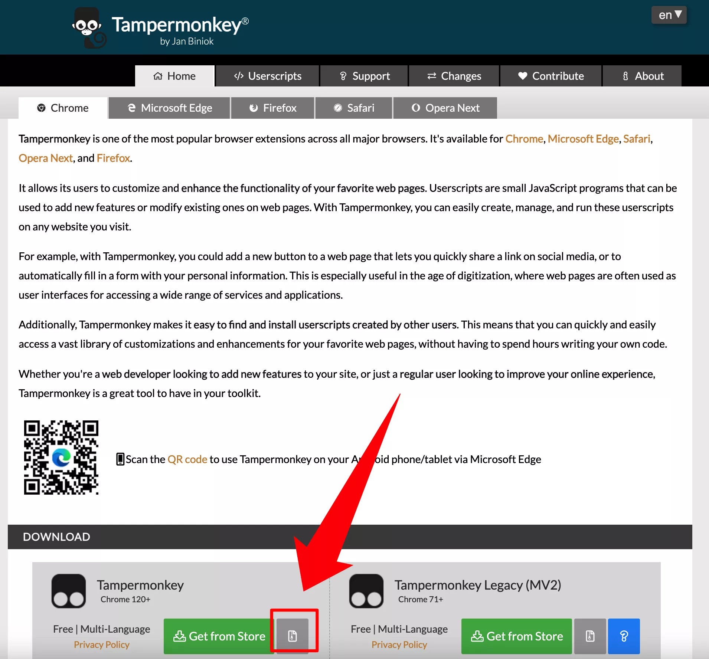
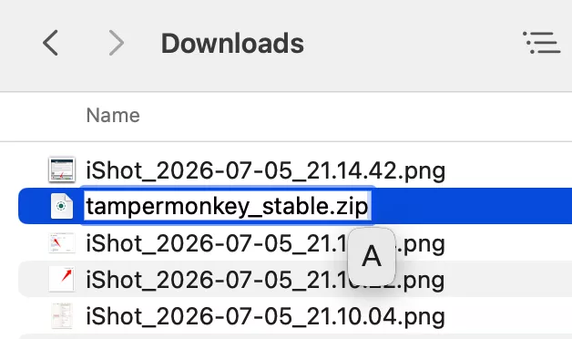
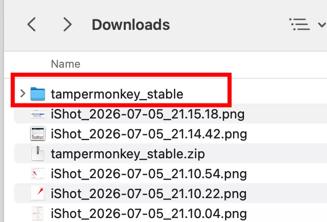
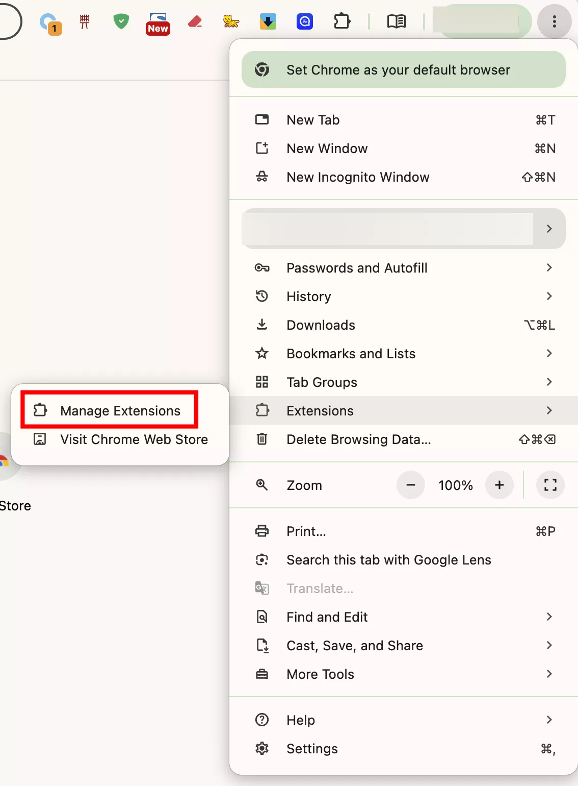
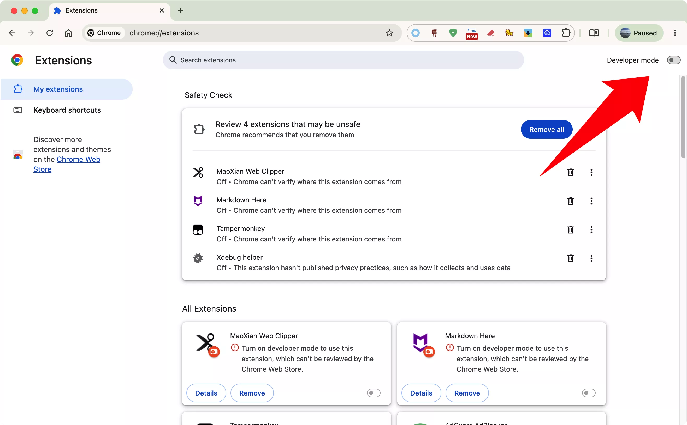
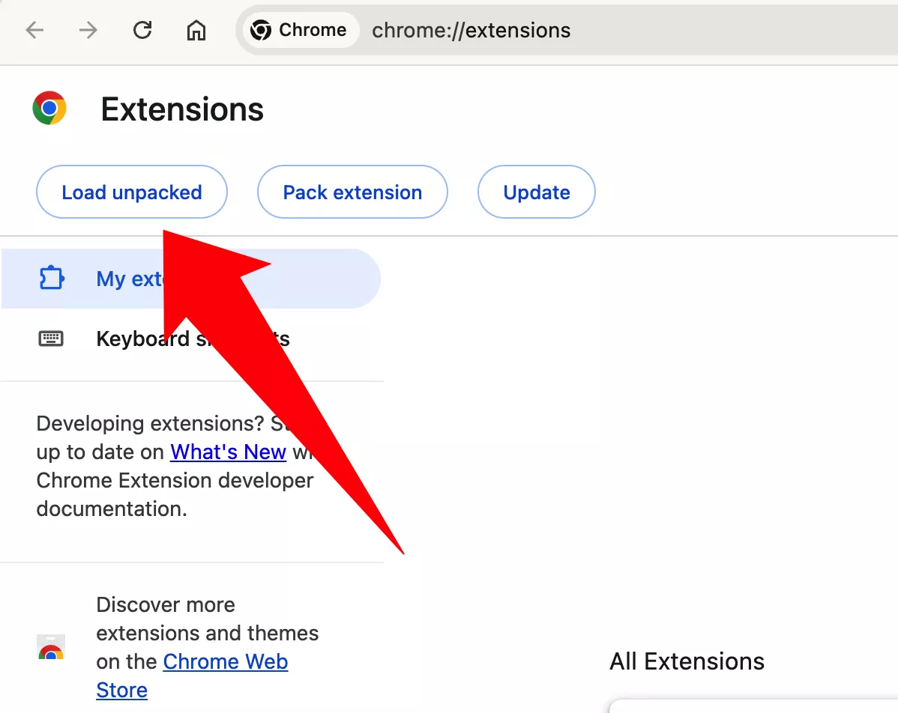
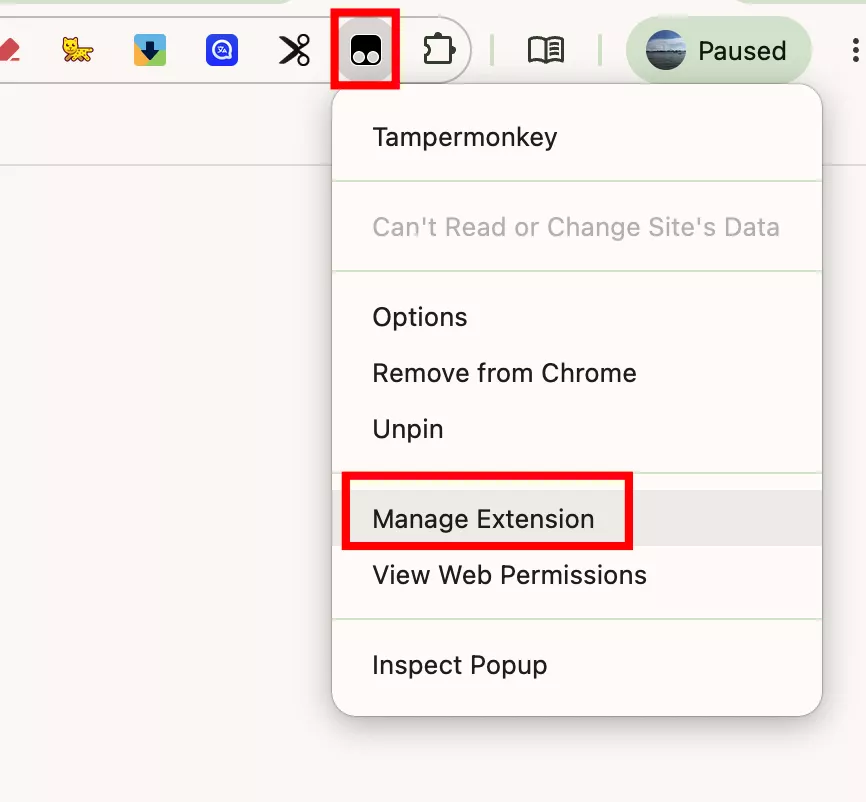
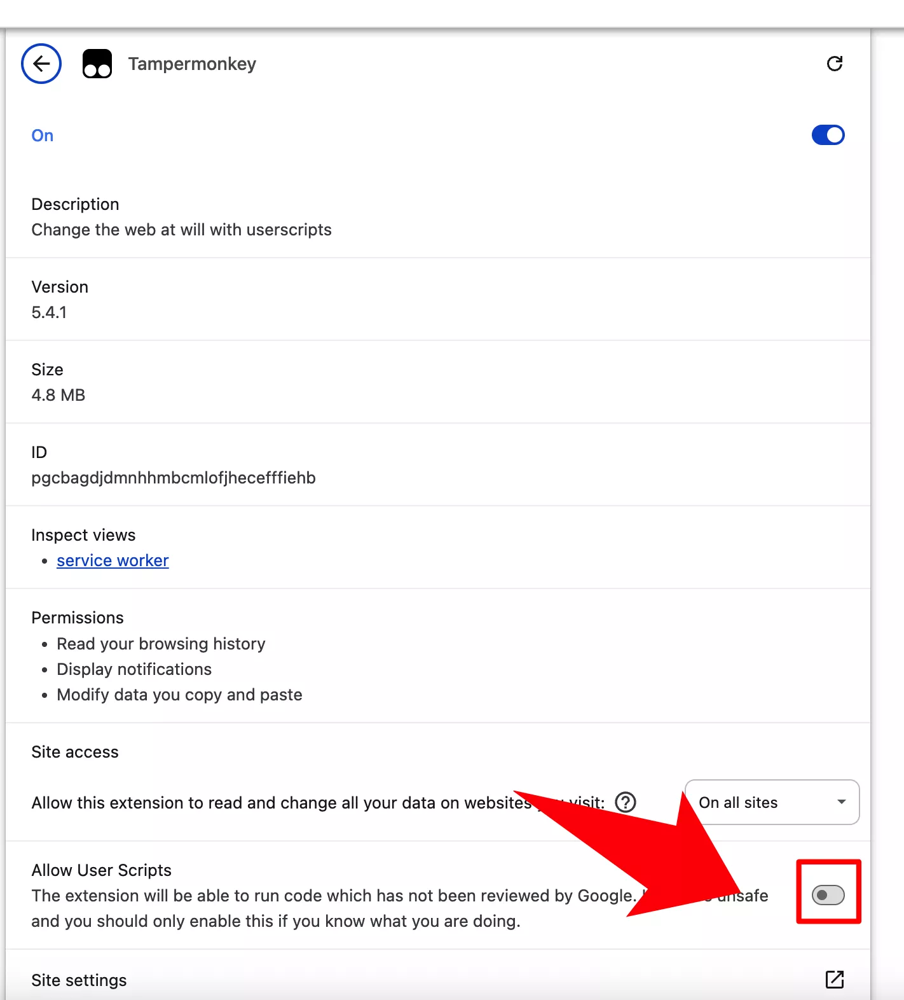
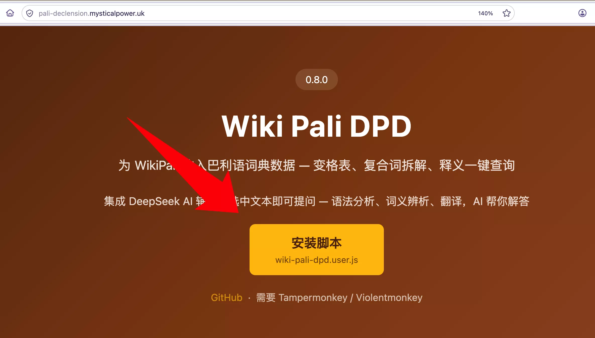
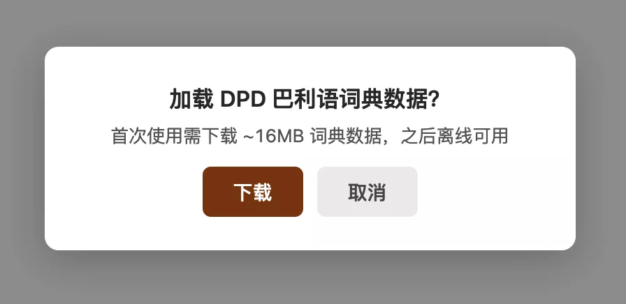

# Chrome 开发者模式安装

如果不能从 Chrome 网上应用店安装，可以通过开发者模式手动加载 Tampermonkey。

> 这种方式适合无法访问 Chrome 网上应用店的用户。

## 前置准备

  
  还没有 Chrome 浏览器？
  <a href="https://www.google.cn/intl/zh-CN/chrome/" target="_blank" rel="noopener" style="font-weight:500;">下载 Chrome →</a>

## 第一步：下载 Tampermonkey CRX

1. 打开 [Tampermonkey 官网](https://www.tampermonkey.net/)
2. 点击页面上的 "Get from Store" 或 "去商店" 右侧的**图标** 按钮
3. 点击就会下载 **CRX** 格式的扩展文件

## 第二步：重命名为 ZIP 并解压

1. 将下载的 `.crx` 文件重命名为 `.zip`
2. 将 ZIP 文件解压到本地文件夹

## 第三步：打开扩展管理页面

在 Chrome 地址栏输入 `chrome://extensions`，或通过设置菜单进入：

## 第四步：开启开发者模式

在扩展页面右上角找到 **「开发者模式」** 开关，将其打开。

## 第五步：加载已解压的扩展

1. 点击左上角的 **「加载已解压的扩展程序」** 按钮
2. 选择第二步中解压出来的文件夹（包含 `manifest.json`）
3. 点击「选择文件夹」

## 第六步：允许 Tampermonkey 管理用户脚本

1. 在地址栏右侧的 Tampermonkey 图标上**右键单击**

2. 在弹出的菜单中选择 **「管理扩展」**
3. 在扩展详情页中开启 **「允许用户脚本」**（或 **Allow User Scripts**）开关
4. 开启后刷新已打开的网页使其生效

## 第七步：安装 Wikipali DPD 脚本

1. 打开 [Wikipali DPD 安装页面](https://pali-declension.mysticalpower.uk/)
2. 点击页面中央的 **「安装脚本」** 按钮

3. Tampermonkey 会自动弹出安装页面
4. 点击 **「安装」** 确认

## 第八步：验证与使用

1. 打开 <a href="https://next.wikipali.cc/pcd/dict/recent" target="_blank" rel="noopener">Wikipali 词典页面</a>（新标签页打开）
2. 页面自动弹出下载数据提示，点击 **「下载」**

3. 下载完成后在搜索框中输入 `dhamma` 搜索

4. 搜索结果上方会显示 DPD 信息栏，包含词性、释义等信息

## 注意事项

- Chrome 每次启动时可能提示「请停用开发者模式扩展程序」，点击 **关闭** 即可
- 如果卸载或重装 Chrome，需要重新执行上述步骤
- 这种方式在 Chrome 自动更新后可能需要重新加载

> 💡 如果你能通过网上应用店安装，建议走普通安装方式更简便。
