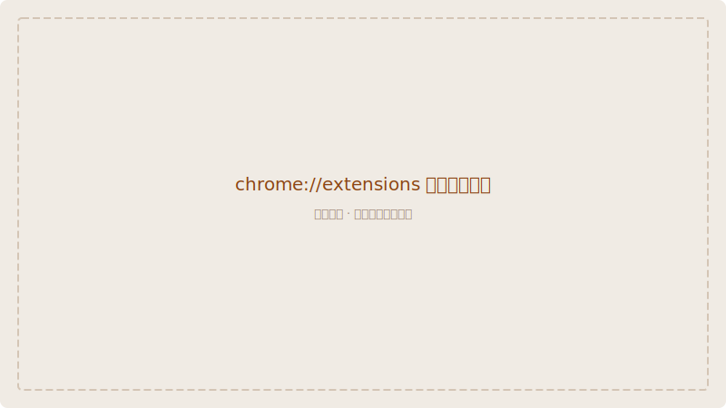
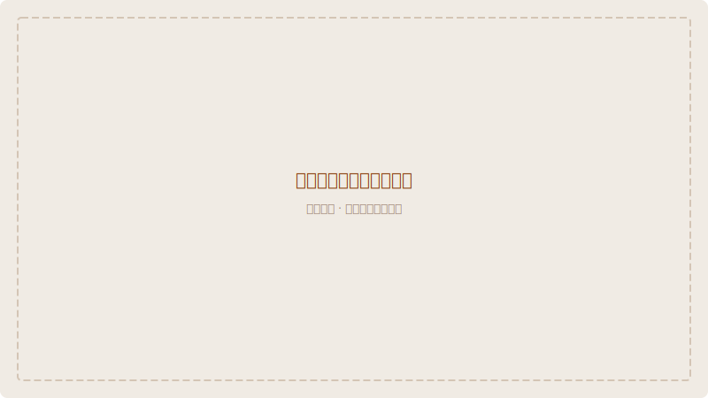
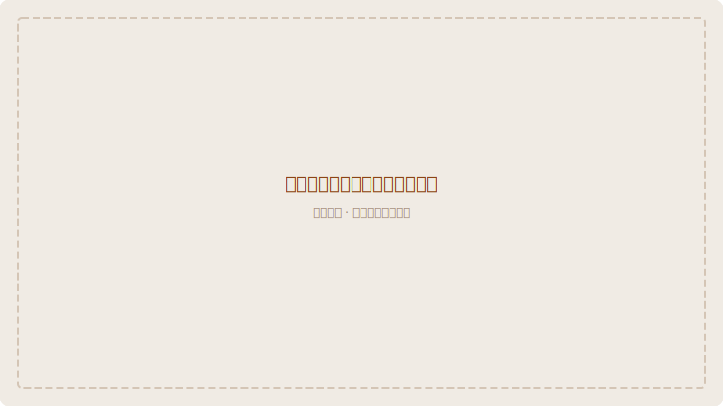

# Chrome 开发者模式安装

此方式适用于 **Violentmonkey**（开源脚本管理器）。通过 Chrome 的「加载已解压的扩展程序」功能安装。

> **推荐使用 Violentmonkey** — 开源、轻量、无广告，与 Tampermonkey 完全兼容。

## 第一步：下载 Violentmonkey

从 [Violentmonkey 官网](https://violentmonkey.github.io/) 下载扩展的 ZIP 文件：

1. 打开 [violentmonkey.github.io](https://violentmonkey.github.io/)
2. 点击页面上的 **「Get it for Chrome」** 按钮
3. 如果引导到 Chrome 网上应用店，也可以直接搜索安装
4. 或者下载 [GitHub 上的源码 ZIP](https://github.com/violentmonkey/violentmonkey/releases)

> 如果 Chrome 网上应用店可以直接安装，建议使用商店版本，更简单。

## 第二步：打开扩展管理页面

在 Chrome 地址栏输入：

```
chrome://extensions
```

按回车键进入扩展管理页面。



## 第三步：开启开发者模式

在扩展页面右上角，找到 **「开发者模式」** 开关，将其打开。



开启后，页面左上角会出现三个新按钮：「加载已解压的扩展程序」、「打包扩展程序」、「更新」。

## 第四步：加载已解压的扩展

如果下载的是 ZIP 文件，先解压到本地文件夹。然后：

1. 点击 **「加载已解压的扩展程序」** 按钮
2. 在弹出的文件选择器中，选择解压后包含 `manifest.json` 的文件夹
3. 点击「选择文件夹」



扩展安装成功后，地址栏右侧会出现 Violentmonkey 的图标。

## 第五步：安装 Wiki Pali DPD 脚本

1. 点击工具栏中的 Violentmonkey 图标
2. 选择 **「新建脚本」** 旁边的 **「从 URL 安装」**
3. 输入以下地址：

```
https://pali-declension.mysticalpower.uk/wiki-pali-dpd.user.js
```

4. 点击「安装」，Violentmonkey 会打开脚本安装页面
5. 点击 **「安装」** 确认

## 第六步：验证与使用

1. 打开 [WikiPali](https://wikipali.cc)
2. 搜索任意巴利语单词（如 `buddha`）
3. 弹出下载数据提示时，点击 **「下载」**
4. 下载完成后，搜索结果上方会显示 DPD 信息栏

## 开发者模式注意事项

- Chrome 会在每次启动时提示「请停用开发者模式扩展程序」，点击**取消/关闭**即可，不影响使用
- 如果卸载或重装 Chrome，需要重新执行上述步骤
- 这种方式适合无法通过 Chrome 网上应用店安装的用户

## Tampermonkey vs Violentmonkey

| 对比项 | Tampermonkey | Violentmonkey |
|--------|-------------|---------------|
| 开源 | ❌ 部分开源 | ✅ 完全开源 |
| 广告 | 有推广链接 | 无广告 |
| 性能 | 优秀 | 同样优秀 |
| 兼容性 | 最好 | 与 TM 完全兼容 |
| 安装方式 | 商店直接安装 | 商店安装 或 解压加载 |
| 推荐度 | ⭐⭐⭐⭐ | ⭐⭐⭐⭐⭐ |
