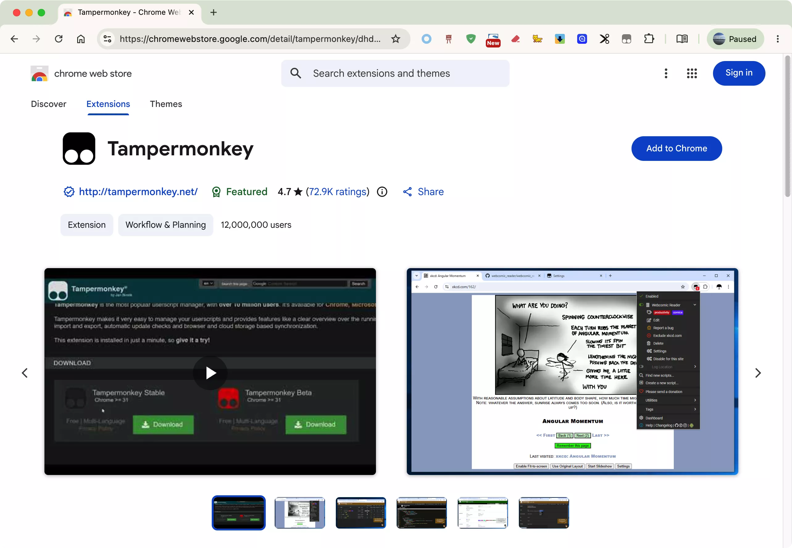
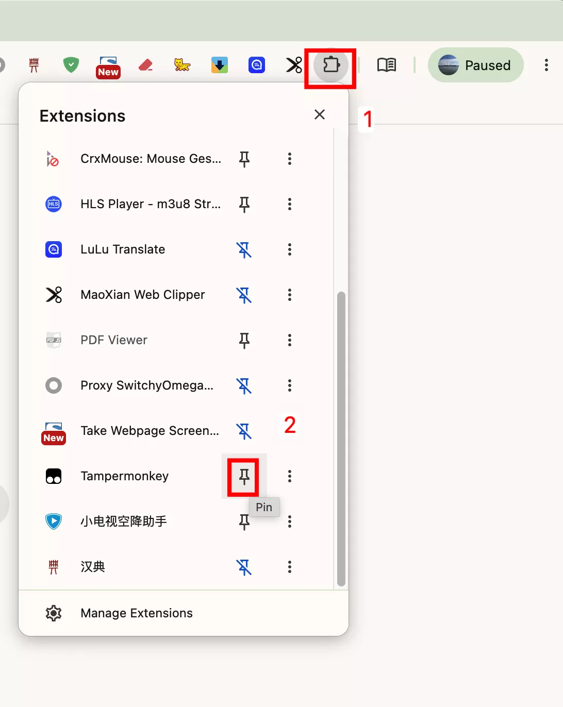
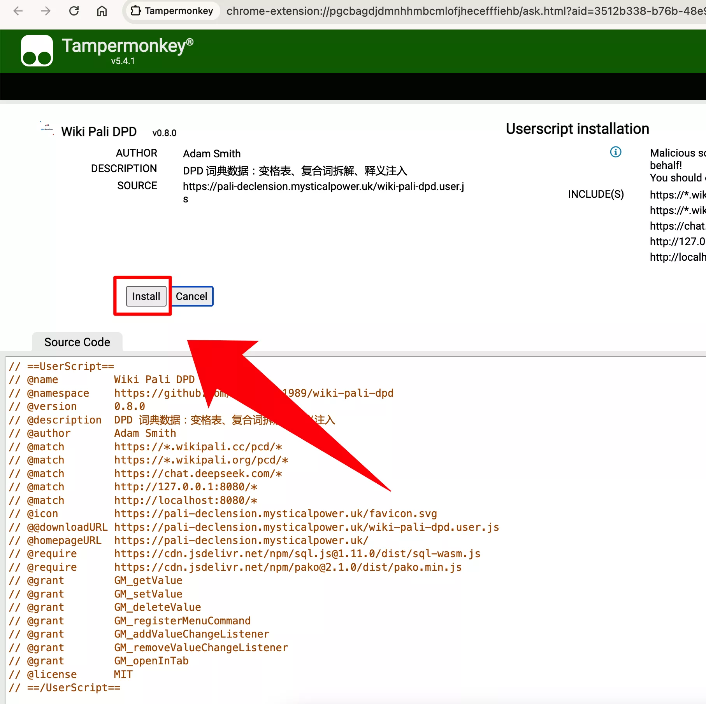

# Chrome 浏览器安装指南

通过 Chrome 网上应用店安装 **Tampermonkey**，然后安装脚本。

> **为什么用 Tampermonkey？** Chrome 最新版仅支持 Manifest V3 扩展，Violentmonkey 基于 MV2 已无法在 Chrome 上运行。Tampermonkey 已适配 MV3，是 Chrome 下的最佳选择。
>
> Firefox 和 Edge 仍可使用 Violentmonkey，详见对应安装页面。

## 前置准备

  
  还没有 Chrome 浏览器？
  <a href="https://www.google.cn/intl/zh-CN/chrome/" target="_blank" rel="noopener" style="font-weight:500;">下载 Chrome →</a>

- 一个可用的网络连接

## 第一步：安装 Tampermonkey

1. 打开 Chrome 浏览器
2. 访问 Chrome 网上应用店中的 [Tampermonkey 页面](https://chromewebstore.google.com/detail/tampermonkey/dhdgffkkebhmkfjojejmpbldmpobfkfo)

3. 点击右上角的 **「添加到 Chrome」**
4. 安装完成后，地址栏右侧会出现 Tampermonkey 的图标（）

## 第二步：固定 Tampermonkey（推荐）

为了方便管理脚本，将 Tampermonkey 固定到工具栏上：

1. 点击地址栏右侧的 **拼图图标**（扩展程序管理）
2. 在列表中找到 Tampermonkey
3. 点击其右侧的 **📌 图钉按钮**，使其变为蓝色固定状态

## 第三步：允许 Tampermonkey 管理用户脚本

新版 Chrome 需要额外授予 Tampermonkey 管理用户脚本的权限：

1. 在地址栏右侧的 Tampermonkey 图标上**右键单击**

2. 在弹出的菜单中选择 **「管理扩展」**
3. 在扩展详情页中开启 **「允许用户脚本」**（或 **Allow User Scripts**）开关
4. 开启后刷新已打开的网页使其生效

## 第四步：安装 Wikipali DPD 脚本

1. 打开 [Wikipali DPD 安装页面](https://pali-declension.mysticalpower.uk/)
2. 点击页面中央的 **「安装脚本」** 按钮

3. Tampermonkey 会自动弹出安装页面
4. 查看脚本信息，点击 **「安装」** 确认

## 第五步：首次使用

1. 打开 <a href="https://next.wikipali.cc/pcd/dict/recent" target="_blank" rel="noopener">Wikipali 词典页面</a>（以新标签页打开）
2. 页面自动弹出提示框询问是否下载词典数据，点击 **「下载」**

3. 等待下载完成（约需数秒到十几秒，词典数据约 18MB）
4. 下载完成后，在搜索框输入 `dhamma` 搜索即可看到 DPD 词典信息栏

## 验证安装

在 <a href="https://next.wikipali.cc/pcd/dict/recent" target="_blank" rel="noopener">Wikipali 页面</a>点击工具栏 Tampermonkey 图标，可以看到 DPD 脚本的菜单项：

搜索巴利语单词后，搜索结果上方会显示 DPD 信息栏，点击可展开查看变格表、复合词拆解。

## 故障排查

| 问题 | 解决方法 |
|------|---------|
| 安装脚本后没有反应 | 刷新 Wikipali 页面。检查地址栏右侧 Tampermonkey 图标是否为彩色（灰色表示已禁用） |
| 下载数据失败 | 检查网络连接，稍后重试。|
| 看不到 DPD 信息栏 | 确保搜索的是巴利语单词，且单词在 DPD 词典中有收录 |
