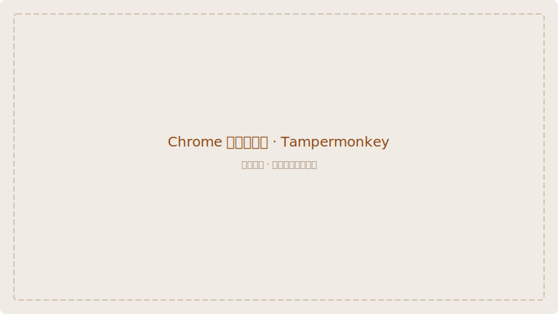
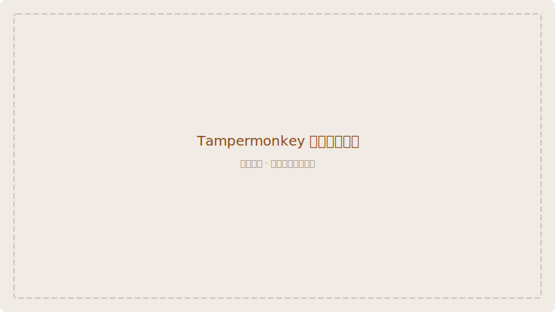

# Chrome 浏览器安装指南

通过 Chrome 网上应用店安装 **Violentmonkey**（推荐），然后安装脚本。

> **为什么推荐 Violentmonkey？** 开源、轻量、无广告，与 Tampermonkey 完全兼容。
> 如果你已有 Tampermonkey 习惯，也可以直接使用，同样支持本脚本。

## 第一步：安装 Violentmonkey

1. 打开 Chrome 浏览器
2. 访问 Chrome 网上应用店中的 [Violentmonkey 页面](https://chromewebstore.google.com/detail/violentmonkey/jinjaccalgkegednnccohejagnlnfdag)

3. 点击右上角的 **「添加到 Chrome」** 按钮
4. 在弹出的确认窗口中点击 **「添加扩展程序」**

5. 安装完成后，地址栏右侧会出现 Violentmonkey 的图标（）

## 第二步：安装 Wiki Pali DPD 脚本

1. 打开 [Wiki Pali DPD 安装页面](https://pali-declension.mysticalpower.uk/)
2. 点击页面中央的 **「安装脚本」** 按钮

3. Violentmonkey 会自动弹出安装窗口
4. 查看脚本信息后，点击 **「安装」** 即可

## 第三步：验证安装

1. 打开 [WikiPali 词典页面](https://wikipali.cc)
2. 在搜索框中输入 `buddha`
3. 页面会弹出提示框询问是否下载词典数据，点击 **「下载」**

4. 下载完成后，搜索 `buddha`，搜索结果上方会显示 DPD 词典信息栏

恭喜！你已经成功安装并可以使用 Wiki Pali DPD 了。🎉

## 故障排查

| 问题 | 解决方法 |
|------|---------|
| 安装脚本后没有反应 | 刷新 WikiPali 页面。检查地址栏右侧扩展图标是否为彩色（灰色表示已禁用） |
| 下载数据失败 | 检查网络连接，或稍后重试。也可以在 DPD 设置面板中配置自定义数据地址 |
| 看不到 DPD 信息栏 | 确保搜索的是巴利语单词，且单词在 DPD 词典中有收录 |

> 💡 如果你之前已经安装了 **Tampermonkey**，流程完全一致，同样支持本脚本的所有功能。
