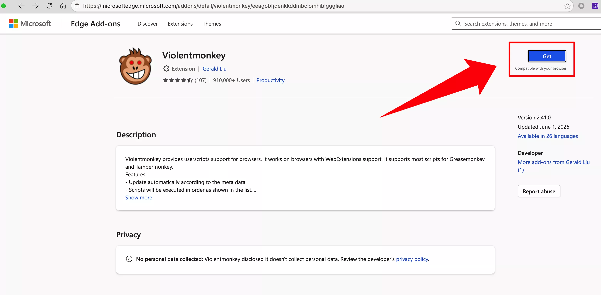
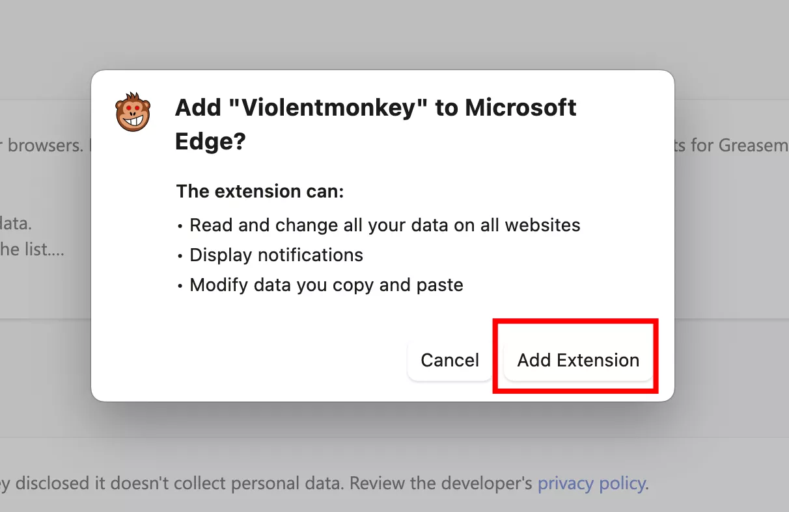
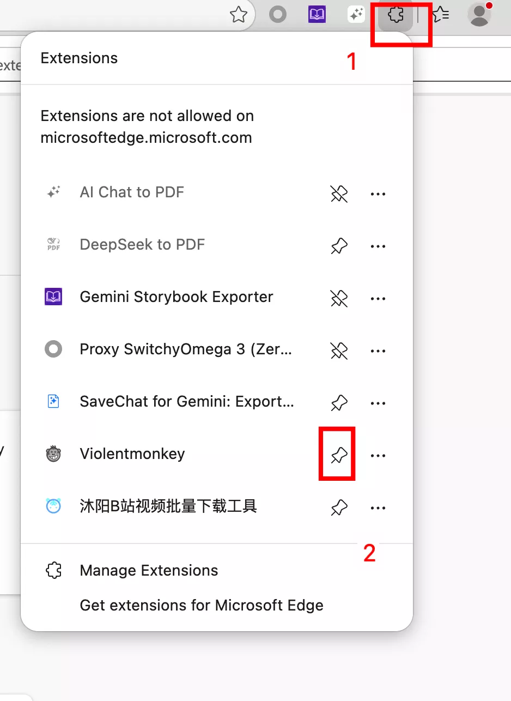
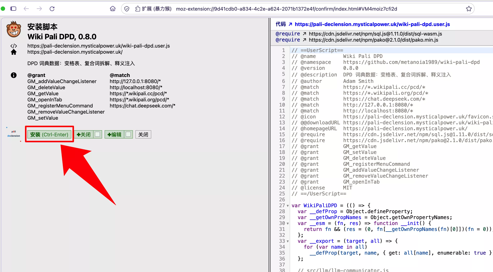

# Edge 浏览器安装指南

通过 Edge 扩展商店安装 **Violentmonkey**，然后安装脚本。

> 如果你更习惯 **Tampermonkey**，同样兼容安装流程完全一致。

## 前置准备

  
  还没有 Edge 浏览器？
  <a href="https://www.microsoft.com/zh-cn/edge" target="_blank" rel="noopener" style="font-weight:500;">下载 Edge →</a>

- 一个可用的网络连接

## 第一步：安装 Violentmonkey

1. 打开 Edge 浏览器
2. 访问 Edge 扩展商店中的 [Violentmonkey 页面](https://microsoftedge.microsoft.com/addons/detail/violentmonkey/eeagobfjdenkkddmbclomhiblgggliao)

3. 点击 **「获取」** 按钮
4. 在弹出的确认窗口中点击 **「添加扩展」**

5. 将 Violentmonkey 固定到工具栏方便管理

## 第二步：安装 Wikipali DPD 脚本

1. 打开 [Wikipali DPD 安装页面](https://pali-declension.mysticalpower.uk/)
2. 点击页面中央的 **「安装脚本」** 按钮

3. Violentmonkey 会自动弹出安装页面

4. 点击 **「安装」** 即可

## 第三步：首次使用

1. 打开 <a href="https://next.wikipali.cc/pcd/dict/recent" target="_blank" rel="noopener">Wikipali 词典页面</a>（以新标签页打开）
2. 页面自动弹出提示框询问是否下载词典数据，点击 **「下载」**

3. 下载完成后在搜索框中输入 `dhamma` 搜索即可看到 DPD 词典信息栏

## 第四步：验证

在 <a href="https://next.wikipali.cc/pcd/dict/recent" target="_blank" rel="noopener">Wikipali 页面</a>点击工具栏 Violentmonkey 图标可以看到 DPD 脚本的菜单项。

搜索 `dhamma` 后结果上方会出现 DPD 信息栏：

## 故障排查

| 问题 | 解决方法 |
|------|---------|
| 无法安装扩展 | 确保 Edge 已更新到最新版本 |
| 脚本不工作 | 检查 Violentmonkey 是否为启用状态（图标彩色） |
| 搜索不到单词 | 确认输入的是巴利语罗马字符 |

> Edge 和 Chrome 使用相同的内核（Chromium），但 Violentmonkey 在 Edge 上以 MV2 方式正常运行。
