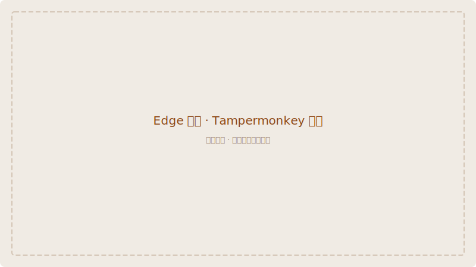
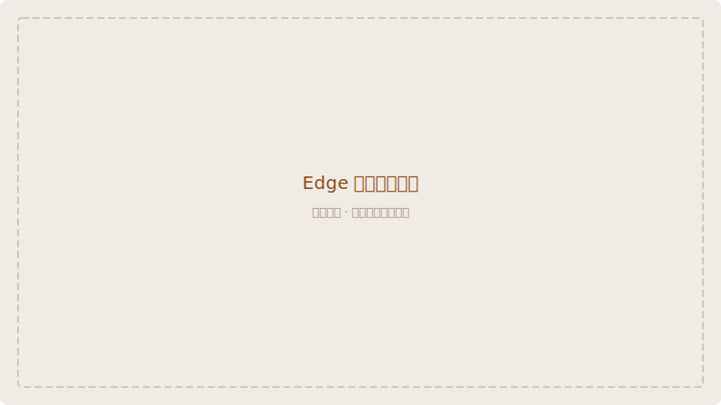

# Edge 浏览器安装指南

通过 Edge 扩展商店安装 **Violentmonkey**（推荐），然后安装脚本。

> 如果你更习惯 **Tampermonkey**，同样兼容，安装流程完全一致。

## 第一步：安装 Violentmonkey

1. 打开 Edge 浏览器
2. 访问 Edge 扩展商店中的 [Violentmonkey 页面](https://microsoftedge.microsoft.com/addons/detail/violentmonkey/eeagobfjdenkkddmbclomkkhmmjlndjm)

3. 点击 **「获取」** 按钮
4. 在弹出的确认窗口中点击 **「添加扩展」**

5. 安装完成后，地址栏右侧会出现 Violentmonkey 图标

## 第二步：安装 Wiki Pali DPD 脚本

1. 打开 [Wiki Pali DPD 安装页面](https://pali-declension.mysticalpower.uk/)
2. 点击页面中央的 **「安装脚本」** 按钮

3. Violentmonkey 会自动弹出安装页面
4. 点击 **「安装」** 即可

## 第三步：首次使用

1. 打开 [WikiPali 词典页面](https://wikipali.cc)
2. 输入一个巴利语单词（如 `buddha`）
3. 页面弹出词典数据下载提示时，点击 **「下载」**

4. 下载完成后，刷新或重新搜索即可看到 DPD 词典信息

## 第四步：验证

搜索 `dhamma`，搜索结果上方会出现 DPD 信息栏，包含词性、释义等信息。

## 故障排查

| 问题 | 解决方法 |
|------|---------|
| 无法安装扩展 | Edge 版本过旧？确保 Edge 已更新到最新版本 |
| 安装按钮灰色 | 需要登录 Microsoft 账户才能安装扩展 |
| 脚本不工作 | 检查扩展是否为启用状态（图标彩色）。刷新页面后重试 |
| 搜索不到单词 | 确认输入的是巴利语罗马字符 |

> 💡 Edge 和 Chrome 使用相同的内核（Chromium），Violentmonkey 的体验也完全一致。
