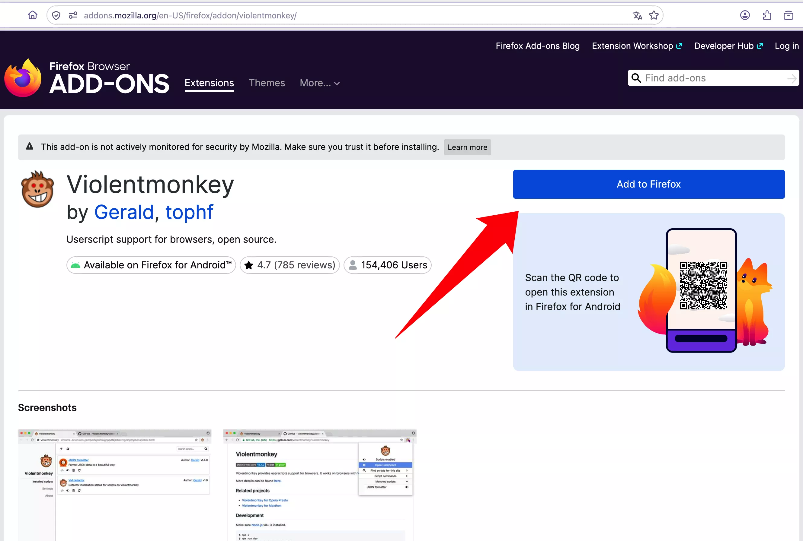
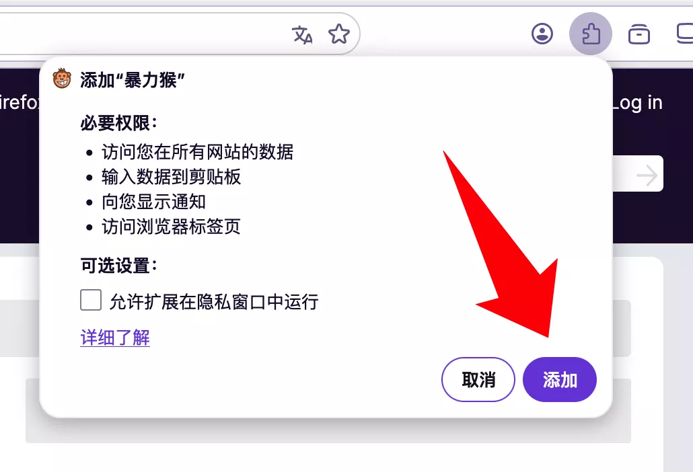
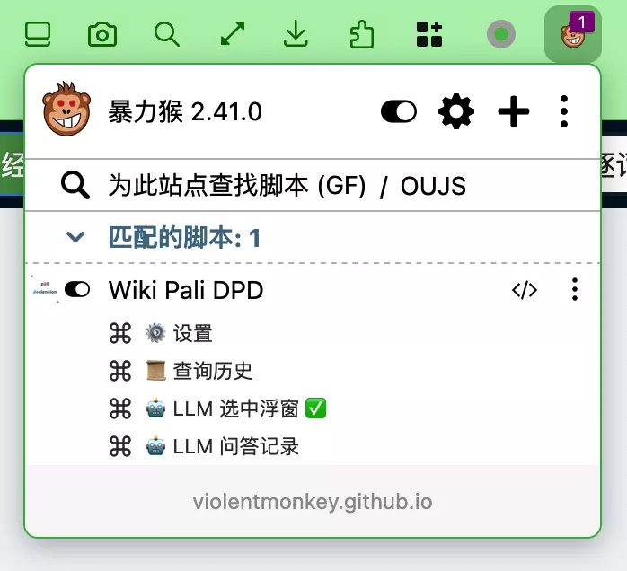

# Firefox 浏览器安装指南

通过 Firefox Add-ons 安装 **Violentmonkey**，然后安装脚本。

> 如果你更习惯 **Tampermonkey**，同样兼容安装流程完全一致。

## 前置准备

  
  还没有 Firefox 浏览器？
  <a href="https://www.mozilla.org/zh-CN/firefox/" target="_blank" rel="noopener" style="font-weight:500;">下载 Firefox →</a>

- 一个可用的网络连接

## 第一步：安装 Violentmonkey

1. 打开 Firefox 浏览器
2. 访问 Firefox Add-ons 中的 [Violentmonkey 页面](https://addons.mozilla.org/en-US/firefox/addon/violentmonkey/)

3. 点击 **「添加到 Firefox」** 按钮
4. 在弹出的确认窗口中点击 **「添加」**

5. 可选：将 Violentmonkey 固定到工具栏以便管理

## 第二步：安装 Wikipali DPD 脚本

1. 打开 [Wikipali DPD 安装页面](https://pali-declension.mysticalpower.uk/)
2. 点击页面中央的 **「安装脚本」** 按钮

3. Violentmonkey 会自动弹出安装页面

4. 查看脚本信息后点击 **「安装」** 即可

## 第三步：首次使用

1. 打开 <a href="https://next.wikipali.cc/pcd/dict/recent" target="_blank" rel="noopener">Wikipali 词典页面</a>（以新标签页打开）
2. 页面自动弹出提示框询问是否下载词典数据，点击 **「下载」**

3. 等待下载完成，词典数据即缓存到浏览器中
4. 在搜索框中输入 `dhamma` 搜索即可看到 DPD 信息栏

## 第四步：验证

在 <a href="https://next.wikipali.cc/pcd/dict/recent" target="_blank" rel="noopener">Wikipali 页面</a>点击工具栏 Violentmonkey 图标，可以看到 DPD 脚本的菜单项：

搜索 `dhamma` 后结果上方会显示 DPD 信息栏：

## 故障排查

| 问题 | 解决方法 |
|------|---------|
| 找不到「安装脚本」按钮 | 确认页面已完全加载，尝试刷新 |
| 扩展没有弹出 | 检查浏览器是否阻止了弹窗 |
| 词典数据下载慢 | 数据约 18MB，较慢网络下可能需要 1-2 分钟 |
| 脚本无效 | 刷新 Wikipali 页面，确认 Violentmonkey 图标为彩色 |
