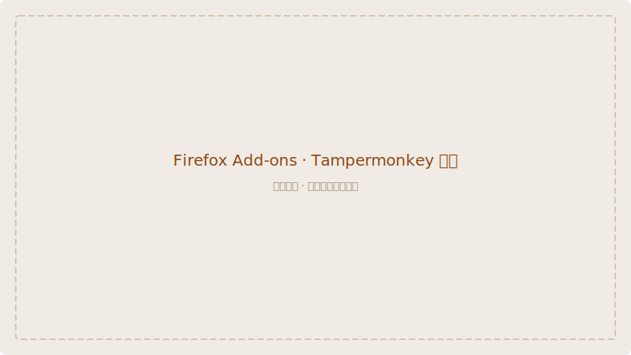
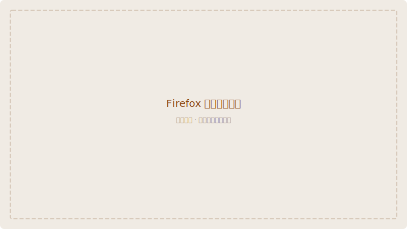
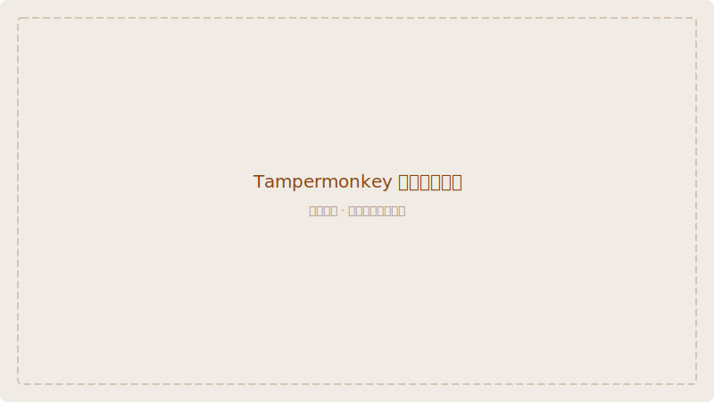

# Firefox 浏览器安装指南

通过 Firefox Add-ons 安装 **Violentmonkey**（推荐），然后安装脚本。

> 如果你更习惯 **Tampermonkey**，同样兼容，安装流程完全一致。

## 第一步：安装 Violentmonkey

1. 打开 Firefox 浏览器
2. 访问 Firefox Add-ons 中的 [Violentmonkey 页面](https://addons.mozilla.org/firefox/addon/violentmonkey/)

3. 点击 **「添加到 Firefox」** 按钮
4. 在弹出的确认窗口中点击 **「添加」**

5. 安装完成后，地址栏右侧会出现 Violentmonkey 的图标

## 第二步：安装 Wiki Pali DPD 脚本

1. 打开 [Wiki Pali DPD 安装页面](https://pali-declension.mysticalpower.uk/)
2. 点击页面中央的 **「安装脚本」** 按钮

3. Violentmonkey 会自动弹出安装页面
4. 查看脚本信息后，点击 **「安装」** 即可

## 第三步：首次使用

1. 打开 [WikiPali 词典页面](https://wikipali.cc)
2. 在搜索框中输入一个巴利语单词（如 `buddha`）
3. 页面会弹出提示框询问是否下载词典数据

4. 点击 **「下载」**，等待进度条走完
5. 下载完成后，词典数据即缓存到浏览器中

## 第四步：验证

搜索 `buddha`，搜索结果上方会出现一个棕色的 DPD 信息栏。点击展开可以查看变格表、复合词拆解等详细信息。

## 故障排查

| 问题 | 解决方法 |
|------|---------|
| 找不到「安装脚本」按钮 | 确认页面已经完全加载，如果仍然看不到，尝试刷新页面 |
| 扩展没有弹出 | 检查浏览器是否阻止了弹窗。可以在地址栏左侧查看弹窗拦截状态 |
| 词典数据下载慢 | 数据约 18MB，在较慢网络下可能需要 1-2 分钟，请耐心等待 |
| 脚本无效 | 刷新 WikiPali 页面。确认扩展图标为彩色而非灰色 |
