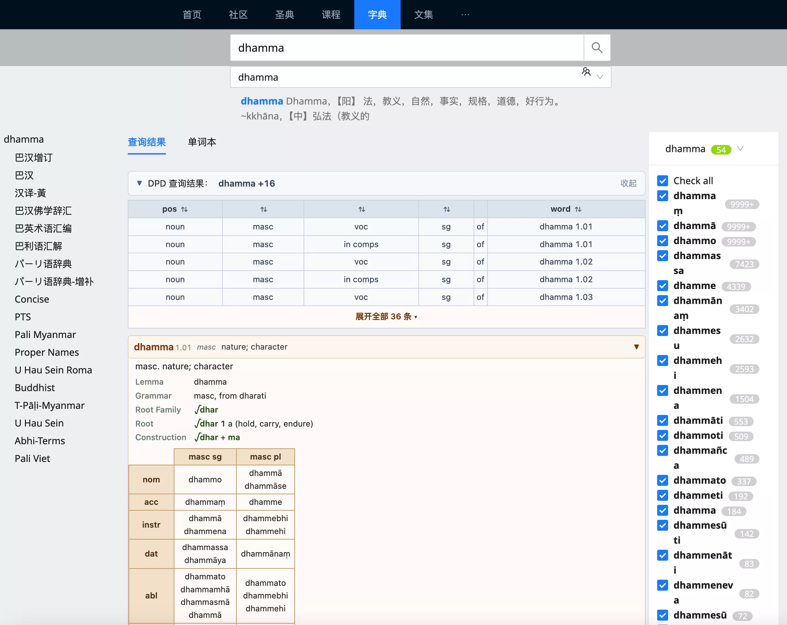
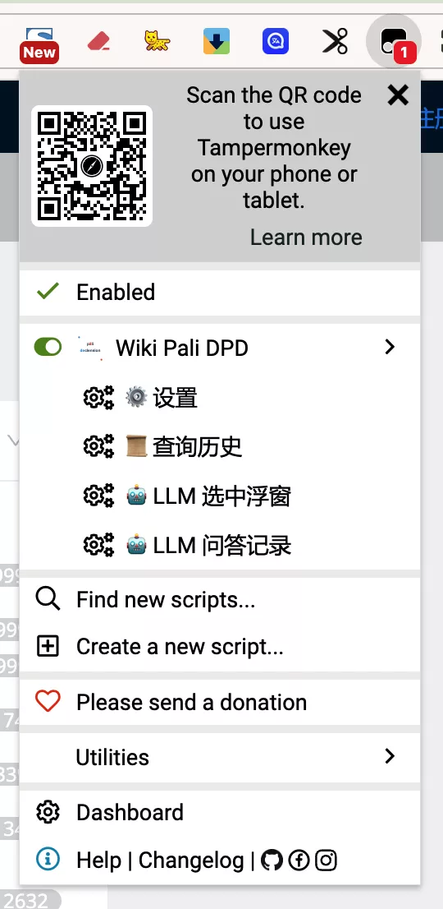

# 使用说明

详细说明如何在 Wikipali 中使用本脚本的各项功能。

## 基本搜索

安装并下载数据后，打开 <a href="https://next.wikipali.cc/pcd/dict/recent" target="_blank" rel="noopener">Wikipali 词典页面</a>（以新标签页打开）：

1. 在搜索框中输入巴利语单词（使用罗马字母，如 `buddha`、`dhamma`、`saṅgha`）
2. Wikipali 显示搜索结果的同时，DPD 信息栏会出现在结果上方
3. 信息栏显示词头（lemma_1）、词性（pos）和释义

> 脚本同时支持两种搜索方式：
> - **搜索框输入** — 手动输入单词后回车或点击搜索按钮
> - **文中词点击** — 点击文章中带 `.pcd_word` 样式的巴利语单词

## 查看词条详情

DPD 信息栏默认显示概要信息。点击信息栏可以展开查看完整内容。

### 展开后可以看到

- **词条列表** — 如果单词对应多个词条（如一词多性），会列出所有词条供切换
- **变格表** — 名词、形容词的完整变格表，按性别分列
- **复合词拆解** — 如果是复合词，显示拆解结果和各个组成部分
- **词根信息** — 显示词根（root）及其含义
- **语法说明** — 构词法、词源等信息

### 多条词目的切换

一个单词可能有多个词条（比如 `sādhu` 既可以是形容词也可以是名词）。信息栏会显示所有词条的**词头 + 词性 + 释义**，点击不同词条可切换查看对应的变格表。

## 使用 AI 辅助功能

脚本集成了 DeepSeek AI，可以帮助你分析语法、解释词义。

### 开启 AI 功能

1. 点击扩展图标，打开菜单
2. 点击 **「LLM 选中浮窗」**，菜单项显示 ✅ 表示已开启
3. 首次开启后永久生效，所有页面均有效

### 使用 AI 提问

1. 在 DPD 面板中（变格表、释义区等）用鼠标选中文本
2. 文本附近会出现浮动菜单，包含预设提示词按钮
3. 可选择预设问题，或在输入框中自行输入问题
4. 点击发送，DeepSeek 页面会自动打开（首次需登录）
5. Agent 自动填入内容并发送，回复完成后自动传回浮窗

预设提示词包括：
- **解释词义** — 对选中词汇进行详细解释
- **分析语法** — 分析变格/变位形式
- **翻译** — 翻译选中的短语
- **新开对话** — 勾选后开启独立会话，不影响当前对话上下文

### 查看问答记录

所有 AI 问答记录自动缓存到本地。通过扩展菜单中的 **「LLM 问答记录」** 可以浏览和回顾。

## 扩展菜单功能

安装脚本后，在 <a href="https://next.wikipali.cc/pcd/dict/recent" target="_blank" rel="noopener">Wikipali 页面</a>点击浏览器工具栏中的扩展图标，可以看到以下菜单项：

> 注：Chrome 用户为 Tampermonkey 菜单，Firefox/Edge 用户为 Violentmonkey 菜单，功能一致。

| 菜单项 | 功能 |
|--------|------|
| ⚙️ 设置 | 打开 DPD 设置面板（版本信息、清除缓存等） |
| 📜 查询历史 | 浏览所有查询过的单词历史 |
| 🤖 LLM 选中浮窗 | 切换 AI 辅助功能的开关状态 |
| 🤖 LLM 问答记录 | 查看 AI 问答历史记录 |

## 搜索技巧

### 输入变格形式

脚本支持直接搜索变格形式。即使输入的不是原形（lemma），也能自动匹配到对应的词头：

- 输入 `sādhunā` → 找到 `sādhu` 词条
- 输入 `bhikkhave` → 找到 `bhikkhu` 词条
- 输入 `lokaṃ` → 找到 `loka` 词条

### 多词条单词

有些单词有多种词性意义，例如 `sādhu`：
- `sādhu 1` — 形容词（好的、善的）
- `sādhu 5` — 中性名词
- `sādhu 6` — 阳性名词

信息栏会列出所有匹配的词条，单击不同词条切换到对应的变格表。

## 设置面板

通过「设置」面板可以管理：

- **版本信息** — 查看当前脚本版本和数据版本
- **数据管理** — 查看缓存状态，手动清除词典数据缓存
- **数据地址** — 配置自定义词典数据下载地址（适用于自托管数据的用户）
- **调试模式** — 开启后输出详细日志，便于排查问题

## 数据更新

词典数据会不定期更新。当检测到有新版本时：
1. 脚本会自动提示用户更新数据
2. 更新时自动清除旧缓存，重新下载新数据
3. 更新过程不影响已有的查询历史

你也可以在设置面板中手动触发数据更新检查。
